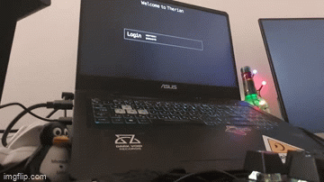

# Deathowl's dummy login manager


A stupidly simple graphical login manager. 
Uses framebuffer, so You wont have to run a wayland session to bootstrap your wayland session (unlike gtkgreet)

This is a greetd frontend.

# Prior work:
Continuation/fork of prior work by [kenylevinsen](https://git.sr.ht/~kennylevinsen/dlm).
This one uses greetd IPC, and also launched WM is now selectable from config file.

# Setup
My greetd config looks like :
```
[terminal]
# The VT to run the greeter on. Can be "next", "current" or a number
# designating the VT.
vt = 7

# The default session, also known as the greeter.
[default_session]

command = "ddlm --target /usr/bin/sway" 

# The user to run the command as. The privileges this user must have depends
# on the greeter. A graphical greeter may for example require the user to be
# in the `video` group.
user = "greetd"
```
# Demo


# Future plans:
* Enable selection of WM on the login screen
* Enable configurable backgrounds for the greeter (bmp for the time being) 
* provide more informative error indicators on the login screen, than just the red blink (eg: Display error message in a box)
